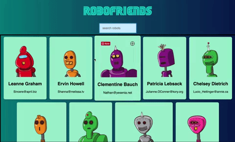

# Robofriends

A simple contacts app where a random robot face is generated for each contact. Accesses the [Robohash](https://robohash.org/) API for generating robot faces, tachyons for styling, [JSONPlaceholder](https://jsonplaceholder.typicode.com/) API for generating a few random users for demo purposes and React.js is handling the front-end.

### Demo

### To-Do

Integrate Google Contacts API or an equivalent to test it as a real-time contacts application. Turn it into a Progressive Web App(PWA).

To run the project:

1. Clone this repo
2. Run `npm install`
3. Run `npm start`

